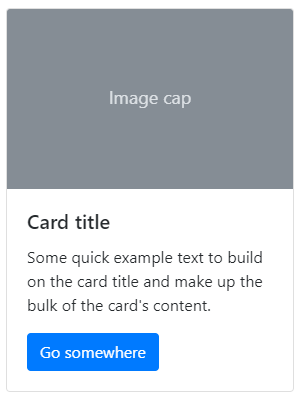

Bootstrap is a CSS library. It includes CSS and Javascript files that you can use to quickly create a web project. Simply link your HTML file to Bootstrap's CSS and Javascript files and use Boostrap classes in your HTML. Bootstrap is responsive and mobile-first, making it a breeze to develop responsive websites. You can customized the look of your site by linking an additional CSS file with your custom CSS styles.

**Starting with Bootstrap**

The quickest and easiest way to start with Bootstrap is to grab the [starter HTML template](https://getbootstrap.com/docs/4.3/getting-started/introduction/#starter-template) from its website. It includes all the necessary links to CSS and JS files that are on the Bootstrap server. Alternatively, you can [download](https://getbootstrap.com/docs/4.3/getting-started/download/#compiled-css-and-js) all Boostrap files and link files locally.

**Using Bootstrap Classes**

Bootstrap classes are listed on its website in the [documentation section](https://getbootstrap.com/docs/4.3/getting-started/introduction/). For example, the class *display-1* will render text as follows:
                .display-1 {
                        font-size: 6rem;
                        font-weight: 300;
                        line-height: 1.2;
                        }

**Bootstrap Components**

Bootstrap [components](https://getbootstrap.com/docs/4.3/components/) are interface elements with a given HTML & CSS code. For example, the fllowing is a card component:

        

            
            

                <h5 class="card-title">Card title</h5>
                
Some quick example text to build on the card title and make up the bulk of the card's content.

                <a href="#" class="btn btn-primary">Go somewhere</a>
            

        

All components are documented on the Boostrap website. The quickest way to include them in your web page is to copy the example HTML provided in the documentation and modify it.
