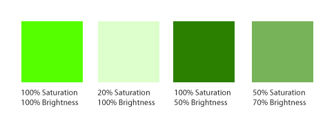
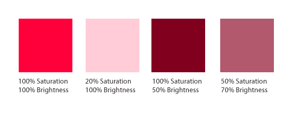
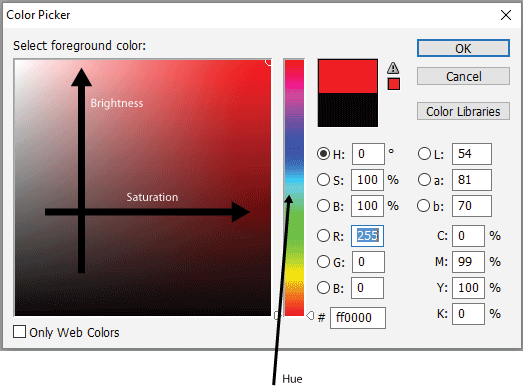
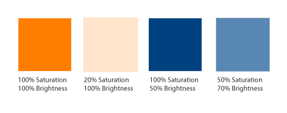

Color sets the mood and tone of the website. Moreover, a well defined color scheme takes crucial part in exposing  and reinforcing the hierarchy inherent in the content and supporting the page layout.

### Understanding color

The three components of color are:
- **Hue** refers to the actual color.
- **Saturation** is the pureness of the color- a color mixed with gray is less saturated. 
- **Brightness** is about the amount of light in the color.

In each of the following color swatch sets the hue is the same while the saturation and brightness vary:

Hue, saturation and brightness can be directly manipulated in the Photoshop color picker:

Often the hue is considered first but the saturation and brightness are equally important and are essential for creating a balanced color scheme.

In most cases highly bright and saturated colors are better used along with less saturated and bright colors, such as in this color scheme:

### Color Temperature

Another quality to consider when combining colors is **temperature**. 
- **Warm colors** are the colors of fire: yellow, orange and red. 
- **Cool colors** are the colors of vegetation, ocean and sky. 

Warm colors attract more attention and seen as moving forward. They are therefore useful for crating emphasis. Cool color seem to recede to the background and will stand out less than warmer colors.
