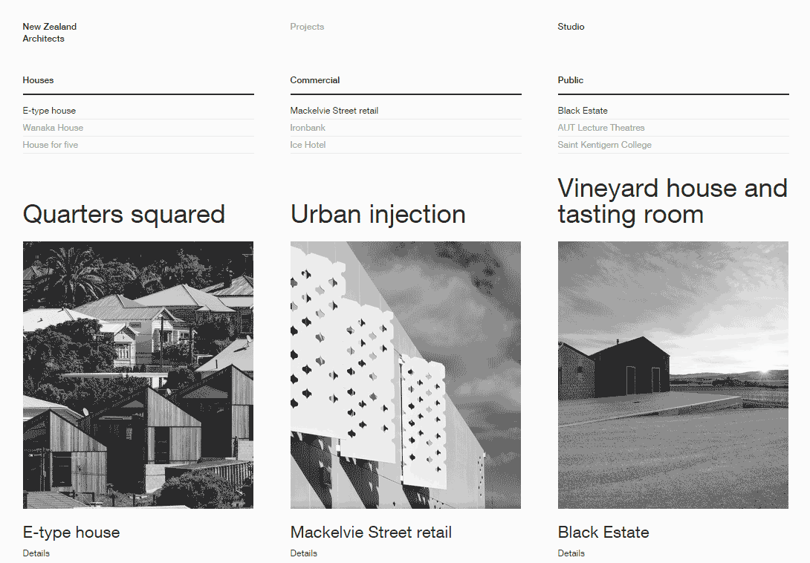
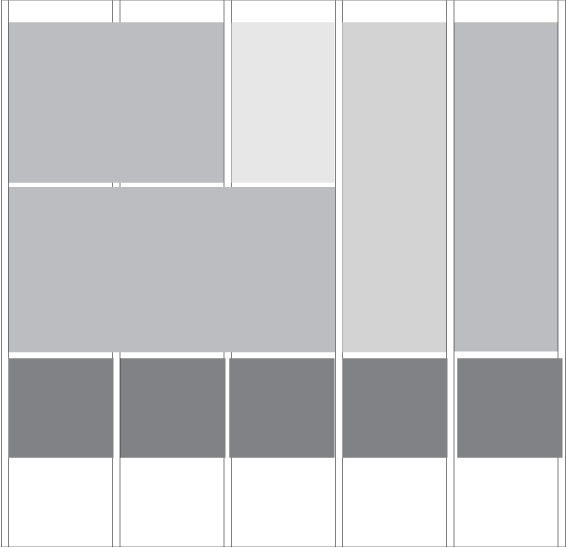

A grid in web design is a set of vertical lines that creates divisions within a page. Grid lines define columns and the spaces between them, called gutters. 

Grids are used as guide in the placement of page elements such as titles, text and images. Page elements can be placed inside one grid division or span a number of divisions. 

One grid can support the creation of multiple layouts while still maintaining a consistent underlying structure throughout an entire website. The example below shows a layout variation of a 5-column grid.

