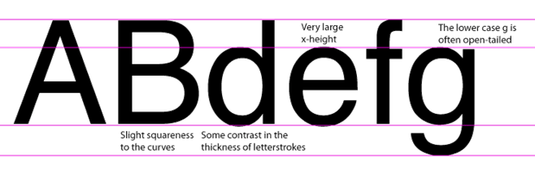
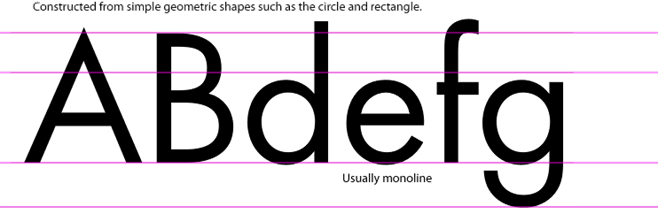
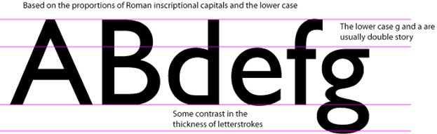

<h2>Type Classification: Sans Serif</h2>

<h3>Grotesque</h3>

Examples: Helvetica, Universe, Franklin Gothic, Grotesque

<h3>Geometric</h3>

Examples: Futura, Kabel

<h3>Humanist</h3>

Examples: Gill Sans, Frutiger, optima

