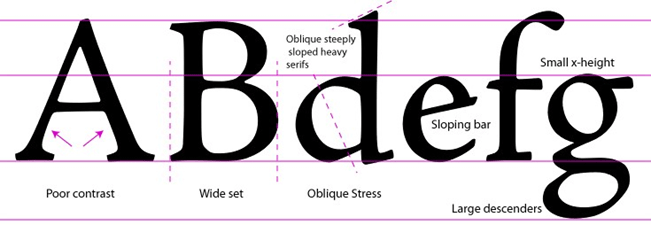
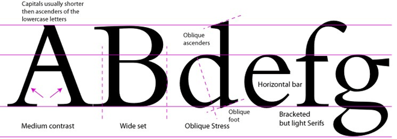
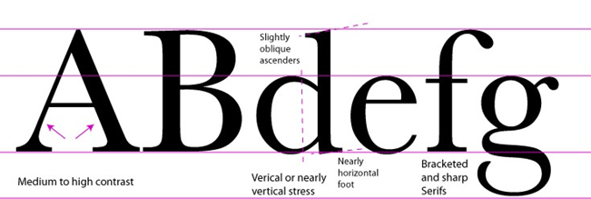
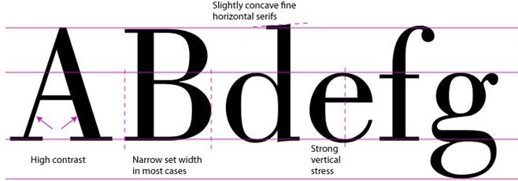
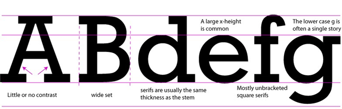

<h2>Type Classification: Serif
</h2>

<h3>Humanist 1460</h3>

Examples: Adobe Jenson and Centaur.
<a href="http://ilovetypography.com/2007/11/06/type-terminology-humanist-2/">Read more</a>.
  

<h3>Old Style 1495</h3>

Examples: Bembo, Adobe Caslon, Adobe Garamond, Goudy Old Style, Palatino, Times New Roman.
<a href="http://ilovetypography.com/2007/11/21/type-terminology-old-style/">Read more</a>.

<h3>Transitional 1750</h3>

Examples: Baskerville, Century Schoolbook, Cheltenham, Bookman
<a href="http://ilovetypography.com/2008/01/17/type-terms-transitional-type/">Read more</a>.
  

<h3>Modern 1775</h3>

Examples: Bodoni, Didot, Bell, Caledonia
<a href="http://ilovetypography.com/2008/05/30/a-brief-history-of-type-part-4/">Read more</a>.
  

<h3>Slab Serif 1825</h3>
Examples: ITC Lubalin Graph, Serifa, Glypha, Schadow, Clarendon, Memphis, Beton, Stymie, Rockwell.
<a href="http://ilovetypography.com/2008/06/20/a-brief-history-of-type-part-5/">Read more</a>.
  

