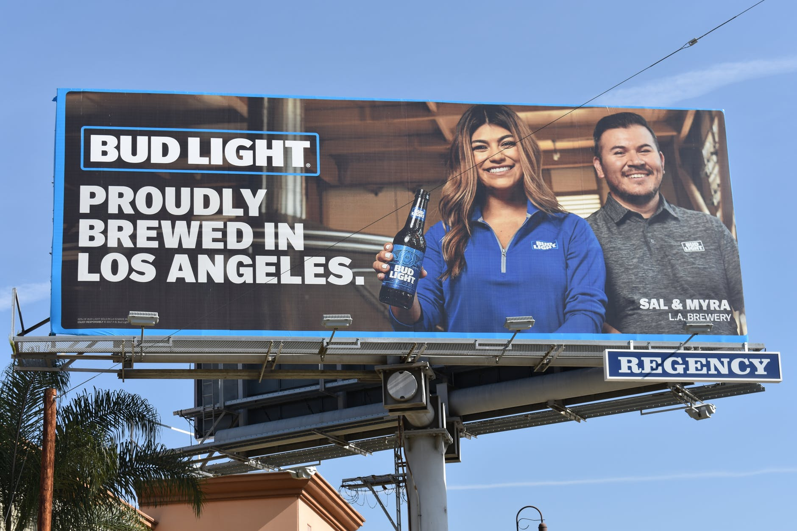
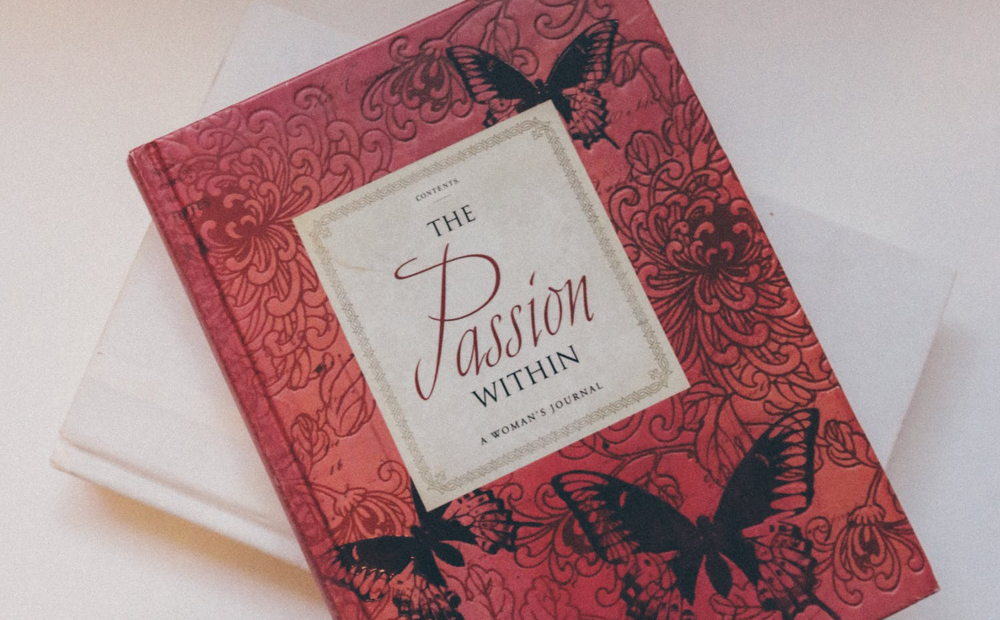
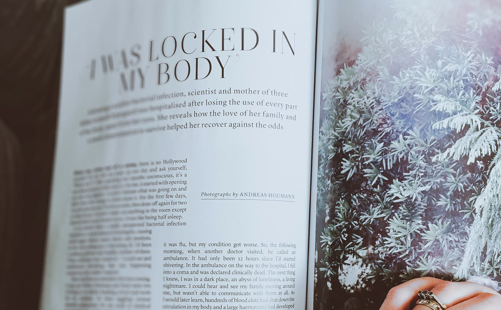

<a href="https://openlab.bmcc.cuny.edu/mmp460"> < Back to MMP 460</a>

<h1>Designing with Display Type</h1>

<a href="display-selecting.html">Selecting Display Type</a> | <a href="display-arranging.html">Arranging Display Type</a> | <a href="display-optical.html">Optical Considerations</a>

<h2>Considerations When Selecting Display Type</h2>

&nbsp;

  <ul>
  <li>Where will the display type be used? For example, a magazine article, a poster, a book, a billboard advertisement. 
        </li>
  <li>Who is the audience? In what conditions will they be viewing your work? 
      
       
  </li>
  <li>The relationship between the display type and the text type: <em>contrast</em> or <em>harmony</em>. 
       
  </li>
 
  <li>Neutral Types  as Display Type  </li>
  
  </ul>
 <li>Typefaces with strong personality</li>
 
  <li>Text Types  as Display Type</li>
  <strong>Display text does not have to be big to attract attention</strong>

</body>
</html>
