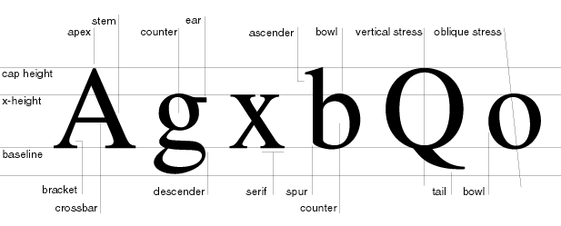
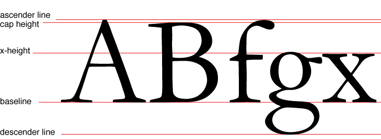
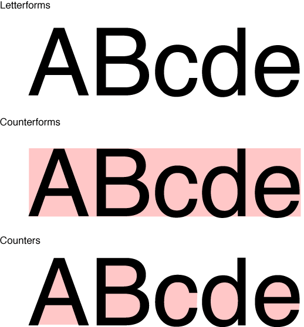
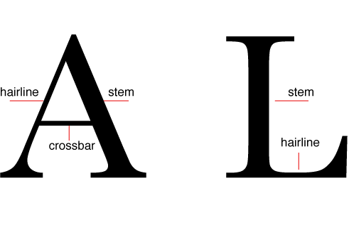
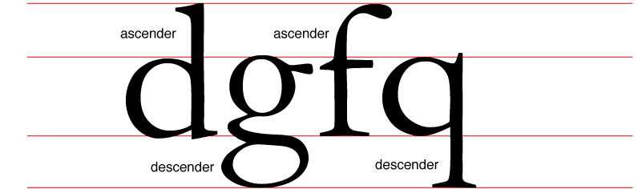
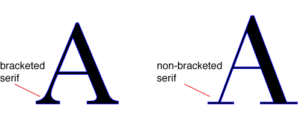
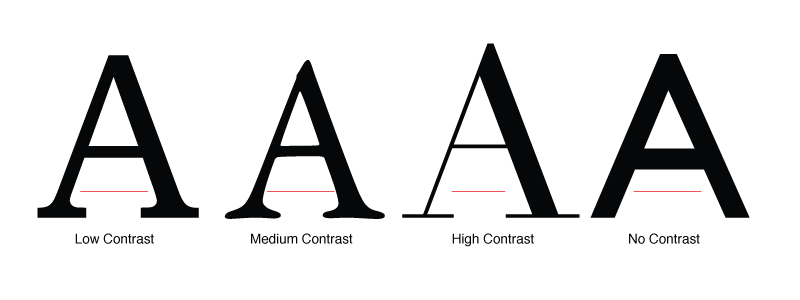
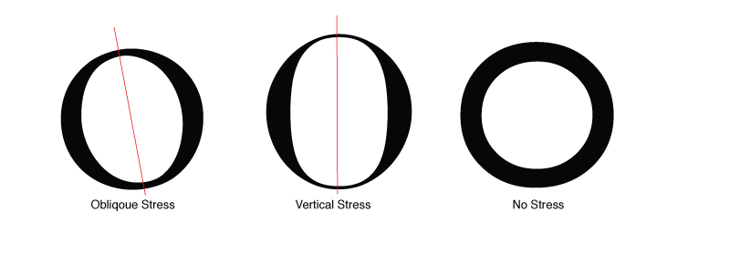

<h1>Type Anatomy</h1>

&nbsp;

<h2>Guidelines</h2>

&nbsp;

<h2>Counters and Counterforms</h2>

&nbsp;

<h2>Strokes</h2>

&nbsp;

<h2>Ascenders and Descenders</h2>

&nbsp;

<h2>Serifs &amp; Brackets</h2>

&nbsp;

<h2>Contrast</h2>

&nbsp;

<h2>Stress</h2>

&nbsp;

<h2>Set Width</h2>

&nbsp;

&nbsp;

