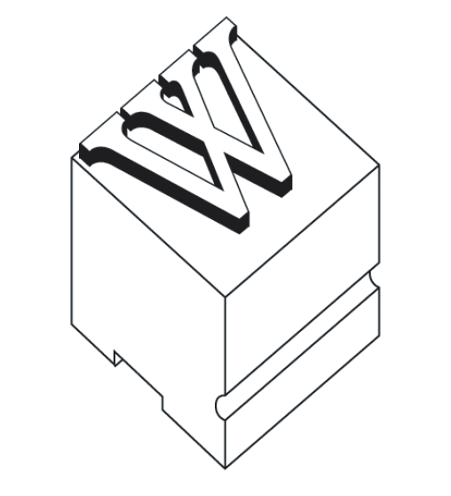
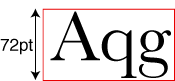
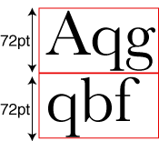

<h2>Type Measurement</h2>

&nbsp;

&nbsp;

<h2>Units</h2>

<strong>Point</strong>

1pt = 1/72&quot;

72pt = 1&quot;

&nbsp;

<strong>Pica</strong>

1p = 12 pt

6p = 1&quot;

&nbsp;

&nbsp;

<h2>Sizing fonts</h2>

&nbsp;

&nbsp;

<h2>Leading</h2>

<strong>Solid Leading:</strong>

&nbsp;

&nbsp;

<strong>72/96 Type ( 72pt type with 96pt leading)</strong>:

&nbsp;

&nbsp;

&nbsp;

&nbsp;

