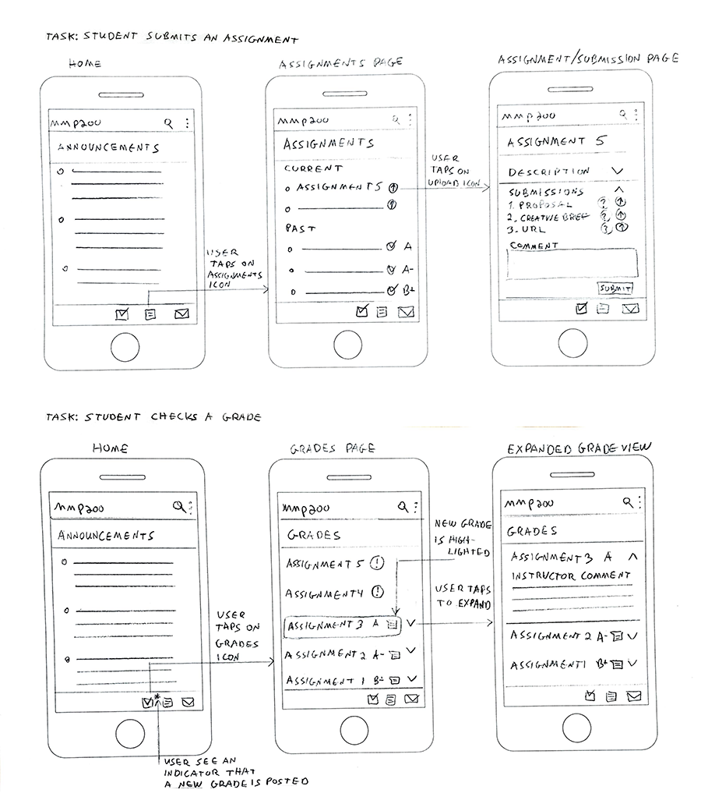

## User Flows

A user flow is a chart, sketches or list of steps that represent a path a user might take complete a task in an application. It helps designers plan the working of an app and find efficient ways for users to accomplish tasks or access content.

When drawing user flows is important to define the user 

For example, the sketches below represent a the process of submitting an assignment in a mobile classroom app.

