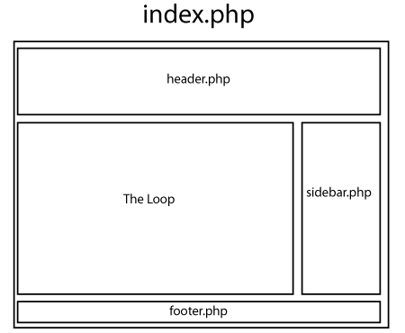

## Anatomy of a WordPress theme

A WordPress theme consists of template files for parts of the pages, such as header and footer and for the type of pages in the site, such as the homepage, static pages and single post pages.

This is how the content of the theme folder might look like:

Note that header.php contains the code for the header part of all pages. Footer.php contains the code for the footer part of all pages. Style.css include the css styles that are used by all pages and functions.php/

Although these files include a lot of hrml

Each of these pages is made of other template files that describe different parts of the page. For example, the index.php below includes the header.php, sidebar.php and footer.php files.

https://github.com/bmcc-mmp/mmp460/tree/master/wordpress/MMP460-minimal-theme
A bare-bone theme mi simple . Comments 

For a complete discussion of how WordPress themes work read: [The anatomy of a WordPress theme](http://yoast.com/wordpress-theme-anatomy/).
