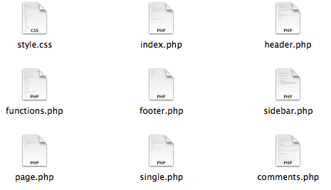

## Anatomy of a WordPress Theme

A WordPress theme consists of template files for parts of the pages, such as header, footer, sidebar and for different types of content, such as posts, static pages, comments and more. In addition it includes a CSS file with the theme styles and sometimes JavaScript files.

This is how the content of the theme folder might look like:
    

This is a diagram of a Wordpress web page that shows the way some templates are used:

Theme templates are PHP files that include the HTML code required to structure pages and PHP code that instructs the server to deliver content from the database. The HTML files that copmrised the website are created on the fly by WordPress based on the templates and the content from the database. 

This is a [bare-bone theme](https://github.com/bmcc-mmp/mmp460/tree/master/wordpress/MMP460-minimal-theme) that can be used to study the basic building blocks on a WordPress theme.  

For a complete discussion of how WordPress themes work read: [The anatomy of a WordPress theme](http://yoast.com/wordpress-theme-anatomy/).
