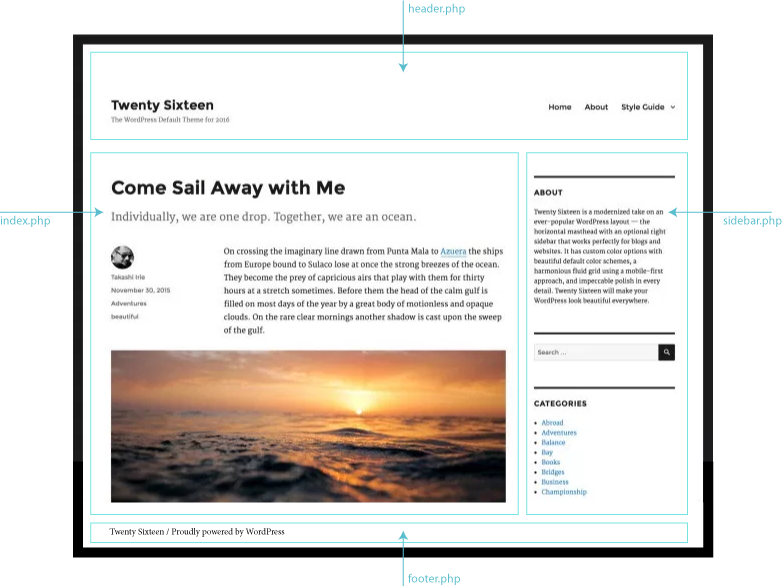

## Anatomy of a WordPress Theme

A WordPress theme consists of template files for parts of the pages, such as header, footer, sidebar and for different types of content, such as posts, static pages, comments and more. In addition, it includes a CSS file with the theme styles and sometimes JavaScript files.

This is how the content of the theme folder might look like:
    

-----------------------------------

This is a diagram of a WordPress web page that shows the way some templates are used:

Theme templates are PHP files that include the HTML code required to structure pages and PHP code that instructs the server to deliver content from the database. The HTML files that comprised the website are generated by WordPress based on the templates and the content from the database. 

This is a [bare-bone theme](https://github.com/bmcc-mmp/mmp460/tree/master/wordpress/MMP460-minimal-theme) that can be used to study the basic building blocks on a WordPress theme.  

For a complete discussion of how WordPress themes work read: [The anatomy of a WordPress theme](http://yoast.com/wordpress-theme-anatomy/).

-----------------------------------

### Template Hierarchy

WordPress searches for the most specific template to generate a page. First, header.php and footer.php are applied to all pages. For the content part of the page, that is sandwiched between the header and the footer WordPress picks the template that is the best match. if there is no specific match it will default to index.php.  For example, for a page that displays a single post WordPress will search for a template that is specific to this post, if not available, it will look for single.php. If single.php is not available it will use index.php. 

[This diagram](https://developer.wordpress.org/files/2014/10/Screenshot-2019-01-23-00.20.04.png) shows which template files are called to generate a WordPress page based on the WordPress template hierarchy. There are many potential templates in the diagram but only index.php is strictly required to have in a theme, although most themes include several more.
