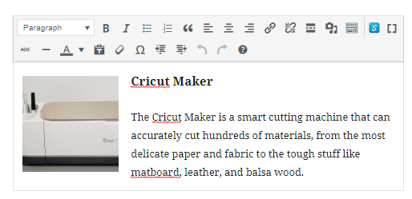
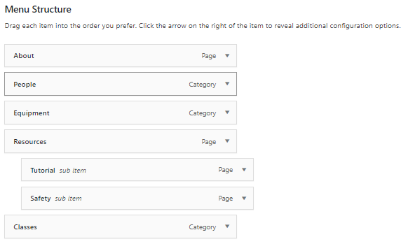

## Starting with WordPress File Management ##

**Logging in**

Log into the WordPress dashboard by entering the following URL in the browser: yoursiteurl/wp-admin. Enter the username and password that you created when you installed the site.

### Entering content ###

You have the choice of entering your content in posts or pages.

**Posts**
Posts are displayed as aggregates and are arranged chronologically. Posts can also be viewed, and be linked to, individually. Use posts for the type of content that come in self-contained units, such as blog posts, news and events, that would make sense to display together.

**Pages**

These are like any web pages. Unlike Posts, they are displayed individually.

**Categories**

You can organize posts in categories and display posts from one category on one page. You can create a direct link to a category page in the menu (see below).

**Media**

Images, videos, audio, PDF and other files can be uploaded to Media. From there, you can insert them to posts or pages.

**The Post Page**

The post page displays the latest posts (the number of which can be controlled in the Settings). It is the homepage by default.

**Changing the homepage**

Using the Post Page as a homepage usually works only for blogs, for all other sites you  can choose any other page to serve as the homepage. To change the homepage choose Settings > Reading and change  ‘Your homepage displays’ to static page. Select a page for your homepage. 

**Editing Posts and Pages**

Using the new WP page and post editor you can add blocs of titles, text, images and other media to the page or post. 

Some text formatting is available as well.

### Controlling the appearance of your website

**Changing Themes**

A theme is a set of templates that dictate the site’s interface and appearance. You can change the theme of the site without affecting its content. A WordPress site comes with a few default themes but there are many other free themes that may fit your sites needs better that you can easily install and use. There are paid themes as well that offer extra functionality. To change the theme, and install new ones choose Appearance> Themes.

**Customizing the theme**

Some customization is possible in Appearance > Customize, including adding css code. 

**The Header**

The header contains the site name and tagline. To enter them choose Settings > General.

Some themes support adding a logo and a background image, both can be done in Appearance > Customize.

**Setting the Main Menu**

The theme dictates where and how the main menu will be displayed. Some themes don’t even support a menu, and some offer more than one, such as a main menu and a footer menu. To set the menu choose Appearance > Menus. On the left you will see the pages, posts and categories that you can choose to include in the menu. You can also add custom links to specific URLs. Use indents in the Menu Structure on the right to create dropdowns. (Dropdowns will only work if the theme includes the code to support them though.) 

Make sure to save the menu and give it a display location. 

**The sidebar**

The sidebar is an optional, separate area on the page that displays the [widgets](https://wordpress.org/support/article/wordpress-widgets/), which add additional content and features with a drag-and-drop easy setup. Examples of widgets are calendar or posts, custom menus or a gallery. The sidebar location and style are determined by the theme. Some themes offer more than one sidebar in different locations. To populate the sidebar, choose Appearance > Widgets. Drag any available widget to the sidebar and modify it as needed.

